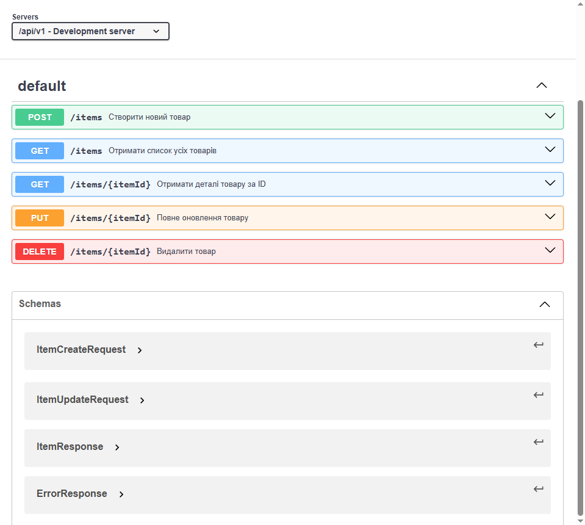

# lab1-team-project
Практична робота 1: Каталог товарів

API Документація (OpenAPI v1.0.0)

Контракт API для управління товарами (Item) описаний згідно зі специфікацією OpenAPI 3.0.3.

- **Специфікація (YAML):** [docs/api/openapi.yaml](docs/api/openapi.yaml)

Swagger UI Рендер

---

Демонстрація CI/CD

В рамках цього проєкту була успішно налаштована Базова Безперервна Інтеграція. Всі кроки (встановлення залежностей, запуск тестів, завантаження артефактів) підтверджені.

* **Посилання на Репозиторій з CI/CD:** [mykhalchukd/ci-cd-demo](https://github.com/mykhalchukd/ci-cd-demo)
* **Статус останнього CI-Workflow:** [Зелена галочка на GitHub Actions](https://github.com/mykhalchukd/ci-cd-demo/actions/runs/20189694505)