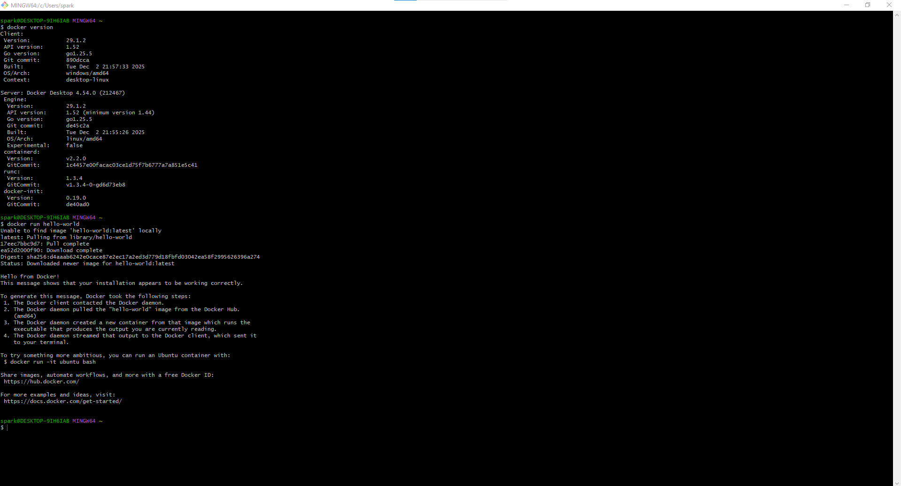

Практична Робота №6: Docker

1. Перевірка Встановлення (60 балів)

1. Встановлення: Використовувався Docker Desktop на Windows з WSL 2.
2. Перевірка: Команди `docker version` та `docker run hello-world` були виконані успішно.

Лог успіху:

